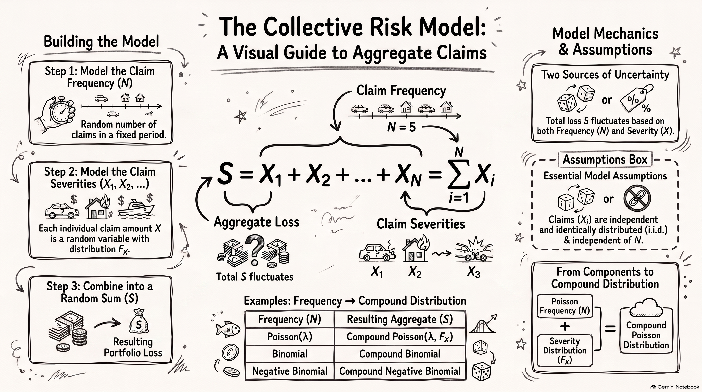
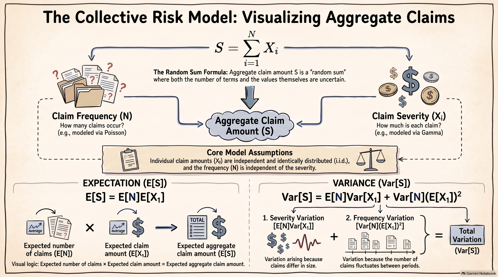

<!-- # Chapter 3: Risk Models {#risk-models} -->

## Collective Risk Model {#collective-risk-model}

Mathematical models of the total amount of claims from a portfolio of policies over a short period of time are presented in this chapter. These models are referred to as **short-term risk models**. Two main sources of uncertainty are considered: the **number of claims** and the **amounts of individual claims**.

We begin with the **collective risk model**, which models the aggregate (total) amount of claims from a portfolio of policies over a fixed time interval.

### Motivation and actuarial interpretation

Consider an insurance company that provides coverage to a portfolio of policyholders over a fixed period, such as one year. During this period, some policyholders may make claims while others may not. In addition, the amounts of the claims can vary substantially from one claim to another.

From the insurer's perspective, the total amount that must be paid in claims is therefore uncertain. Even if the insurer knows the characteristics of the portfolio, it does not know in advance:

1. how many claims will occur during the period; and
2. how much each individual claim will cost.

For example, suppose an insurer has a portfolio of motor insurance policies. During one year, the portfolio may produce 800 claims, while another year may produce 950 claims. Furthermore, the individual claim amounts may range from relatively small claims to very large claims. Consequently, the total amount of claims can vary considerably from year to year.

The collective risk model separates these two sources of uncertainty. The **claim frequency** describes how many claims occur, while the **claim severity** describes the amount of an individual claim. These two components are then combined to obtain a model for the total amount of claims.

This distinction is important in actuarial modelling because the frequency and severity components can have quite different characteristics. For example, the number of claims may be modelled using a discrete probability distribution such as the Poisson distribution, whereas the amount of an individual claim may be modelled using a continuous distribution such as the Gamma, Lognormal, or Pareto distribution.

The collective risk model is therefore useful because it provides a flexible framework for combining a model for the number of claims with a model for the amount of each claim.


### Frequency and severity variables

We define the following random variables:

* $N$ represents the **number of claims** occurring during a fixed time interval;
* $X_i$ denotes the **amount of the $i$th claim**; and
* $S$ denotes the **total amount of claims** during the same time interval.

The random variable $N$ is called the **claim frequency**, while $X_i$ is called the **claim severity**.

The claim frequency $N$ is a discrete random variable taking values in

$$
\{0,1,2,\ldots\}.
$$

For a given value of $N=n$, there are exactly $n$ claims during the time interval. The total amount of these claims is therefore

$$
S = X_1 + X_2 + \cdots + X_n.
$$

The individual claim amounts $X_1,X_2,\ldots$ are random because the amount of a claim is unknown before the claim occurs. We assume that the claim amounts are described by a common distribution function $F_X$.

It is useful to distinguish clearly between the two sources of randomness:

$$
\underbrace{N}_{\text{claim frequency}}
\qquad\text{and}\qquad
\underbrace{X_1,X_2,\ldots}_{\text{claim severities}}.
$$

The aggregate claim amount $S$ depends on both components. A year with many claims can produce a large aggregate loss even when the individual claims are relatively small. Conversely, a year with relatively few claims can still produce a large aggregate loss if one or more claims are unusually large.

::: {.callout-note}
## Two sources of uncertainty

In the collective risk model, the aggregate claim amount is uncertain because of two sources:

1. the **number of claims**, represented by $N$; and
2. the **amounts of individual claims**, represented by $X_1,X_2,\ldots$.

These two sources of uncertainty are combined through the random sum

$$
S = \sum_{i=1}^{N}X_i.
$$
:::

### Definition of the aggregate loss

Let $S$ denote the total amount of claims from a portfolio during a fixed time interval. Conditional on $N=n$, the aggregate loss is

$$
S = \sum_{i=1}^{n}X_i.
$$

Since the number of claims $N$ is itself random, the unconditional aggregate loss is represented by the random sum

$$
S = \sum_{i=1}^{N}X_i.
$$

The random variable $S$ is called the **aggregate loss**, **aggregate claim amount**, or **total claim amount**.


::: {.callout-important}
## Collective risk model

The aggregate claim amount is modelled as

$$
S = \sum_{i=1}^{N}X_i,
$$

where $N$ is the number of claims and $X_i$ is the amount of the $i$th claim.

The number of terms in the sum is therefore random.
:::

An important feature of this definition is that the number of terms in the sum is random. If $N=0$, there are no claims and therefore

$$
S=0.
$$

If $N=1$, then

$$
S=X_1,
$$

while if $N=2$, then

$$
S=X_1+X_2.
$$

More generally, conditional on $N=n$,

$$
S=\sum_{i=1}^{n}X_i.
$$

Thus, the collective risk model is a **random sum model**.

### The collective risk model

The collective risk model is defined by

$$
S = \sum_{i=1}^{N}X_i,
$$

where $N$ represents the number of claims and $X_i$ represents the amount of the $i$th claim.


{#fig-collective-risk-model fig-align="center" width=85%}


The following assumptions are made when deriving the collective risk model:

1. $\{X_i\}_{i=1}^{\infty}$ are independent and identically distributed with distribution function $F_X$.
2. $N$ is independent of $\{X_i\}_{i=1}^{\infty}$.

The first assumption implies that all individual claim amounts have the same distribution and that the amount of one claim does not depend on the amount of another claim.

The second assumption implies that the number of claims is independent of the individual claim amounts. In other words, knowing that a portfolio has produced a large or small number of claims does not provide information about the sizes of those claims.

These assumptions are simplifying assumptions that allow the aggregate claim distribution to be studied using standard probability techniques. They may not always be realistic in practice. For example, claim frequency and claim severity may be related, or claims arising from the same event may not be independent. Nevertheless, the assumptions provide a useful starting point for developing short-term risk models.


::: {.callout-warning}
## Assumptions of the collective risk model

The following assumptions are made:

1. $\{X_i\}_{i=1}^{\infty}$ are independent and identically distributed with distribution function $F_X$.
2. $N$ is independent of $\{X_i\}_{i=1}^{\infty}$.

These assumptions simplify the mathematical analysis of aggregate claims. In practice, they may not always be appropriate. For example, claim frequency and claim severity may be dependent, and claim amounts may not be independent.
:::

Under these assumptions, the distribution of $S$ is called a **compound distribution**.

The collective risk model can therefore be viewed as a combination of two probability models:

$$
\boxed{
\text{Claim frequency model}
+
\text{Claim severity model}
\longrightarrow
\text{Aggregate loss model}
}
$$

The choice of the distribution for $N$ determines the type of compound distribution. Important examples include the following:

| Distribution of $N$ | Distribution of $S$        |
| ------------------- | -------------------------- |
| Binomial            | Compound Binomial          |
| Poisson             | Compound Poisson           |
| Negative binomial   | Compound Negative Binomial |

These compound distributions form an important part of short-term risk modelling.

::: {.callout-note}
## Note

The distribution of $S$ can, in principle, be derived using convolution techniques. However, closed-form expressions for compound distributions generally do not exist. Therefore, we will mainly focus on deriving the moments of $S$ and studying important special cases of the collective risk model.
:::

The collective risk model provides the foundation for several actuarial applications. Once the aggregate loss distribution has been specified, it can be used to study quantities such as the expected total claims, the variability of total claims, the probability that claims exceed a specified amount, the effect of reinsurance, and premium calculation.


## Conditional Expectation and Variance Formulas

Conditional expectation and conditional variance are useful tools for analysing the collective risk model. In particular, they allow us to calculate the mean and variance of an aggregate loss by conditioning on another random variable.

{#fig-conditional-expectation-variance fig-align="center" width=85%}

The **law of total expectation** states that

$$
E[E[X\mid Y]] = E[X].
$$

This result allows the expectation of $X$ to be calculated by first finding the conditional expectation of $X$ given $Y$.

The **conditional variance** of $X$ given $Y$ is defined as

$$
\operatorname{Var}[X\mid Y]
=
E\left[(X-E[X\mid Y])^2\mid Y\right].
$$

Equivalently,

$$
\operatorname{Var}[X\mid Y]
=
E[X^2\mid Y]-(E[X\mid Y])^2.
$$

The **law of total variance** is

$$
\operatorname{Var}[X]
=
E[\operatorname{Var}[X\mid Y]]
+
\operatorname{Var}[E[X\mid Y]].
$$

The first term represents the average variation of $X$ within the different values of $Y$, while the second term represents the variation in the conditional means across the different values of $Y$.

These formulas will be particularly useful when deriving the moments of the aggregate loss

$$
S=\sum_{i=1}^{N}X_i.
$$

::: {.callout-important}
## Two key formulas

The **law of total expectation** is

$$
E[E[X\mid Y]] = E[X].
$$

The **law of total variance** is

$$
\operatorname{Var}[X]
=
E[\operatorname{Var}[X\mid Y]]
+
\operatorname{Var}[E[X\mid Y]].
$$

These formulas allow an unconditional mean or variance to be obtained by first conditioning on another random variable.
:::


::: {#exm-Conditional-claim-amounts}
## Conditional claim amounts

Suppose an insurer classifies a portfolio of policyholders into three risk groups: **Low**, **Medium**, and **High**. A policyholder is selected at random, and the three risk groups are equally likely:

$$
P(L)=P(M)=P(H)=\frac{1}{3}.
$$

Depending on the risk group, the policyholder can experience one of two possible claim amounts. The possible claim amounts, in units of THB, are:

| Risk group | Possible claim amounts (THB) |
| ---------- | ---------------------------: |
| Low        |                     $1$, $2$ |
| Medium     |                     $1$, $5$ |
| High       |                    $1$, $10$ |

Assume that, conditional on the risk group, each of the two claim amounts is equally likely.

Let $X$ denote the claim amount of the selected policyholder.

1. Find the distribution of $X$.
2. Find $E[X]$ and $\operatorname{Var}[X]$.
3. Use the conditional expectation and conditional variance formulas to verify your results.
:::

**Solution**

1. Distribution of $X$

The possible values of $X$ are $1$, $2$, $5$, and $10$.

For example, the probability of a claim amount of $1$ is

$$
\begin{aligned}
P(X=1)
&=P(X=1,L)+P(X=1,M)+P(X=1,H)\\
&=P(X=1\mid L)P(L)
 +P(X=1\mid M)P(M)
 +P(X=1\mid H)P(H)\\
&=\frac{1}{2}\cdot\frac{1}{3}
 +\frac{1}{2}\cdot\frac{1}{3}
 +\frac{1}{2}\cdot\frac{1}{3}\\
&=\frac{1}{2}.
\end{aligned}
$$

Similarly,

$$
P(X=2)=P(X=5)=P(X=10)=\frac{1}{6}.
$$

Therefore, the distribution of $X$ is

| $x$      |           $1$ |           $2$ |           $5$ |          $10$ |
| -------- | ------------: | ------------: | ------------: | ------------: |
| $P(X=x)$ | $\frac{1}{2}$ | $\frac{1}{6}$ | $\frac{1}{6}$ | $\frac{1}{6}$ |

2. Direct calculation of $E[X]$ and $\operatorname{Var}[X]$

The mean claim amount is

$$
\begin{aligned}
E[X]
&=1\left(\frac{1}{2}\right)
+2\left(\frac{1}{6}\right)
+5\left(\frac{1}{6}\right)
+10\left(\frac{1}{6}\right)\\
&=\frac{10}{3}.
\end{aligned}
$$

To calculate the variance, first calculate the second moment:

$$
\begin{aligned}
E[X^2]
&=1^2\left(\frac{1}{2}\right)
+2^2\left(\frac{1}{6}\right)
+5^2\left(\frac{1}{6}\right)
+10^2\left(\frac{1}{6}\right)\\
&=\frac{134}{3}.
\end{aligned}
$$

Hence,

$$
\begin{aligned}
\operatorname{Var}[X]
&=E[X^2]-(E[X])^2\\
&=\frac{134}{3}-\left(\frac{10}{3}\right)^2\\
&=\frac{302}{9}.
\end{aligned}
$$

Thus,

$$
E[X]=\frac{10}{3}
$$

and

$$
\operatorname{Var}[X]=\frac{302}{9}.
$$

3. Verification using conditional expectation and conditional variance

Let $Y$ denote the risk group, where

$$
Y\in\{L,M,H\}.
$$

We first calculate the conditional expectations.

For the Low-risk group,

$$
E[X\mid L]
=
\frac{1}{2}(1+2)
=
\frac{3}{2}.
$$

For the Medium-risk group,

$$
E[X\mid M]
=
\frac{1}{2}(1+5)
=
3.
$$

For the High-risk group,

$$
E[X\mid H]
=
\frac{1}{2}(1+10)
=
\frac{11}{2}.
$$

Using the law of total expectation,

$$
\begin{aligned}
E[X]
&=E[E[X\mid Y]]\\
&=E[X\mid L]P(L)
 +E[X\mid M]P(M)
 +E[X\mid H]P(H)\\
&=\frac{3}{2}\left(\frac{1}{3}\right)
 +3\left(\frac{1}{3}\right)
 +\frac{11}{2}\left(\frac{1}{3}\right)\\
&=\frac{10}{3}.
\end{aligned}
$$

This agrees with the direct calculation.

Next, we calculate the conditional variances.

For the Low-risk group,

$$
\begin{aligned}
\operatorname{Var}[X\mid L]
&=\frac{1}{2}(1^2+2^2)
-\left(\frac{3}{2}\right)^2\\
&=\frac{1}{4}.
\end{aligned}
$$

For the Medium-risk group,

$$
\begin{aligned}
\operatorname{Var}[X\mid M]
&=\frac{1}{2}(1^2+5^2)-3^2\\
&=4.
\end{aligned}
$$

For the High-risk group,

$$
\begin{aligned}
\operatorname{Var}[X\mid H]
&=\frac{1}{2}(1^2+10^2)
-\left(\frac{11}{2}\right)^2\\
&=\frac{81}{4}.
\end{aligned}
$$

Therefore,

$$
\begin{aligned}
E[\operatorname{Var}[X\mid Y]]
&=\frac{1}{4}\left(\frac{1}{3}\right)
+4\left(\frac{1}{3}\right)
+\frac{81}{4}\left(\frac{1}{3}\right)\\
&=\frac{49}{6}.
\end{aligned}
$$

We also have

$$
\begin{aligned}
\operatorname{Var}[E[X\mid Y]]
&=\frac{1}{3}
\left[
\left(\frac{3}{2}-\frac{10}{3}\right)^2
+
\left(3-\frac{10}{3}\right)^2
+
\left(\frac{11}{2}-\frac{10}{3}\right)^2
\right]\\
&=\frac{155}{18}.
\end{aligned}
$$

Using the law of total variance,

$$
\begin{aligned}
\operatorname{Var}[X]
&=E[\operatorname{Var}[X\mid Y]]
+\operatorname{Var}[E[X\mid Y]]\\
&=\frac{49}{6}+\frac{155}{18}\\
&=\frac{302}{9}.
\end{aligned}
$$

This agrees with the variance obtained directly from the distribution of $X$.

::: {.callout-note}
## Interpretation

The law of total variance decomposes the uncertainty in the claim amount into two components:

$$
\operatorname{Var}[X]
=
\underbrace{E[\operatorname{Var}[X\mid Y]]}_{\text{variation within risk groups}}
+
\underbrace{\operatorname{Var}[E[X\mid Y]]}_{\text{variation between risk groups}}.
$$

The first component represents the **average variability of claim amounts within the risk groups**. The second component represents the **variability in the average claim amounts across the risk groups**. In this example, it reflects the differences in average claim amounts among the Low-, Medium-, and High-risk groups.
:::

### Application to the collective risk model

The same ideas will be used to analyse the aggregate claim amount

$$
S=\sum_{i=1}^{N}X_i.
$$

By conditioning on the number of claims $N$, we can first analyse the aggregate claim amount when the number of claims is fixed:

$$
S\mid(N=n) = \sum_{i=1}^{n}X_i.
$$

The conditional expectation is then

$$
E[S\mid N=n]
=
nE[X_1],
$$

and the conditional variance is

$$
\operatorname{Var}[S\mid N=n]
=
n\operatorname{Var}[X_1].
$$

These results will be used in the next section to derive the mean, variance, and higher moments of the collective risk model.


## Moments of the Collective Risk Model

Recall that the aggregate claim amount in the collective risk model is

$$
S=\sum_{i=1}^{N}X_i,
$$

where $N$ is the number of claims and $X_i$ is the amount of the $i$th claim. We assume that $\{X_i\}_{i=1}^{\infty}$ are independent and identically distributed and that $N$ is independent of $\{X_i\}_{i=1}^{\infty}$.

The moments of $S$ can be derived by conditioning on $N$. We first derive general expressions in terms of the moments of $N$ and $X$, before considering particular choices for the distribution of $N$.

### Mean

Let

$$
m_1=E[X_1].
$$

Conditional on $N=n$,

$$
E[S\mid(N=n)]
=
E\left[\sum_{i=1}^{n}X_i\right]
=
nm_1.
$$

Using the law of total expectation,

$$
\begin{aligned}
E[S]
&=E[E[S\mid(N=n)]]\\
&=E[Nm_1]\\
&=E[N]m_1.
\end{aligned}
$$

Therefore,

$$
\boxed{E[S]=E[N]E[X_1].}
$$

Thus, the expected aggregate claim amount is the expected number of claims multiplied by the expected amount of an individual claim.

### Variance

Let

$$
m_2=E[X_1^2].
$$

The variance of an individual claim amount is

$$
\operatorname{Var}[X_1]
=
m_2-m_1^2.
$$

Conditional on $N=n$,

$$
\operatorname{Var}[S\mid(N=n)]
=
n\operatorname{Var}[X_1]
=
n(m_2-m_1^2).
$$

Using the law of total variance,

$$
\begin{aligned}
\operatorname{Var}[S]
&=
E[\operatorname{Var}[S\mid(N=n)]]
+
\operatorname{Var}[E[S\mid(N=n)]]\\
&=
E[N](m_2-m_1^2)
+
\operatorname{Var}[N]m_1^2.
\end{aligned}
$$

Hence,

$$
\boxed{
\operatorname{Var}[S]
=
E[N]\operatorname{Var}[X_1]
+
\operatorname{Var}[N](E[X_1])^2.
}
$$

Equivalently,

$$
\boxed{
\operatorname{Var}[S]
=
E[N](m_2-m_1^2)
+
\operatorname{Var}[N]m_1^2.
}
$$

The first term represents the variability arising from individual claim amounts, while the second term represents the additional variability arising from the random number of claims.

### Third central moment

To derive the coefficient of skewness, we first need the third central moment of $S$.

Let

$$
\mu_X=E[X_1]=m_1,
$$

and define the second and third central moments of $X_1$ by

$$
\sigma_X^2
=
\operatorname{Var}[X_1]
=
m_2-m_1^2
$$

and

$$
\mu_{3,X}
=
E[(X_1-\mu_X)^3].
$$

The third central moment of $N$ is denoted by

$$
\mu_{3,N}
=
E[(N-E[N])^3].
$$

For a random sum, the third central moment of $S$ is

$$
\boxed{
\mu_{3,S}
=
E[N]\mu_{3,X}
+
3\operatorname{Var}[N]\mu_X\sigma_X^2
+
\mu_{3,N}\mu_X^3.
}
$$

Therefore,

$$
\boxed{
\mu_{3,S}
=
E[N]E[(X_1-E[X_1])^3]
+
3\operatorname{Var}[N]E[X_1]\operatorname{Var}[X_1]
+
E[(N-E[N])^3](E[X_1])^3.
}
$$

This expression shows that the skewness of the aggregate claim amount has three sources:

1. skewness in the individual claim amounts;
2. interaction between the variability in the number of claims and the variability in claim amounts; and
3. skewness in the number of claims itself.

### Coefficient of skewness

The coefficient of skewness of a random variable is defined as

$$
\gamma_1
=
\frac{E[(X-E[X])^3]}
{\operatorname{Var}[X]^{3/2}}.
$$

Therefore, the coefficient of skewness of the aggregate claim amount $S$ is

$$
\boxed{
\gamma_{1,S}
=
\frac{\mu_{3,S}}
{\operatorname{Var}[S]^{3/2}}.
}
$$

Substituting the expressions obtained above gives

$$
\boxed{
\gamma_{1,S}
=
\frac{
E[N]\mu_{3,X}
+
3\operatorname{Var}[N]\mu_X\sigma_X^2
+
\mu_{3,N}\mu_X^3
}{
\left(
E[N]\sigma_X^2
+
\operatorname{Var}[N]\mu_X^2
\right)^{3/2}
}.
}
$$

Thus, the first three moments of the collective risk model can be expressed entirely in terms of the corresponding moments of the claim frequency $N$ and claim severity $X$.

### Summary of the general results

Let

$$
\mu_X=E[X_1],
\qquad
\sigma_X^2=\operatorname{Var}[X_1],
\qquad
\mu_{3,X}=E[(X_1-\mu_X)^3],
$$

and

$$
\mu_N=E[N],
\qquad
\sigma_N^2=\operatorname{Var}[N],
\qquad
\mu_{3,N}=E[(N-\mu_N)^3].
$$

Then, for

$$
S=\sum_{i=1}^{N}X_i,
$$

we have

$$
\boxed{
E[S]=\mu_N\mu_X,
}
$$

$$
\boxed{
\operatorname{Var}[S]
=
\mu_N\sigma_X^2+\sigma_N^2\mu_X^2,
}
$$

and

$$
\boxed{
\mu_{3,S}
=
\mu_N\mu_{3,X}
+
3\sigma_N^2\mu_X\sigma_X^2
+
\mu_{3,N}\mu_X^3.
}
$$

Consequently,

$$
\boxed{
\gamma_{1,S}
=
\frac{
\mu_N\mu_{3,X}
+
3\sigma_N^2\mu_X\sigma_X^2
+
\mu_{3,N}\mu_X^3
}{
\left(
\mu_N\sigma_X^2+\sigma_N^2\mu_X^2
\right)^{3/2}
}.
}
$$

::: {.callout-note}
## Random-sum interpretation

The collective risk model can be viewed as a **random sum**:

$$
S=\sum_{i=1}^{N}X_i.
$$

Unlike an ordinary sum, the number of terms is itself random. Conditional on $N=n$, the aggregate claim amount is the sum of exactly $n$ individual claim amounts:

$$
S\mid(N=n)=\sum_{i=1}^{n}X_i.
$$

Thus, the collective risk model combines two sources of randomness:

1. the random number of claims, $N$; and
2. the random claim amounts, $X_1,X_2,\ldots$.

The general moment formulas above show how these two sources of uncertainty combine to determine the distributional characteristics of the aggregate claim amount $S$.
:::

The next step is to specify a distribution for $N$. Important special cases arise when $N$ follows a **binomial**, **Poisson**, or **negative binomial** distribution, leading respectively to the compound binomial, compound Poisson, and compound negative binomial models.


### Moment Generating Function of the Collective Risk Model

The random-sum representation also allows us to derive the moment generating
function (MGF) of the aggregate claim amount.

:::{#exm-mgf-collective-risk-model}
### MGF of the Collective Risk Model

Show that

$$
M_S(t)=M_N\left(\log(M_X(t))\right).
$$
:::

**Solution**

Conditional on $N=n$,

$$
\begin{aligned}
E[e^{tS}\mid(N=n)]
&=
E\left[
e^{t(X_1+X_2+\cdots+X_n)}
\right]\\
&=
E\left[
e^{tX_1}e^{tX_2}\cdots e^{tX_n}
\right]\\
&=
\prod_{i=1}^{n}E[e^{tX_i}]\\
&=
\left(M_X(t)\right)^n,
\end{aligned}
$$

where the independence of $\{X_i\}_{i=1}^{\infty}$ is used in the third
line. Therefore,

$$
E[e^{tS}\mid N]
=
\left(M_X(t)\right)^N.
$$

From the definition of the MGF,

$$
\begin{aligned}
M_S(t)
&=E[e^{tS}]\\
&=E\left[E[e^{tS}\mid N]\right]\\
&=E\left[\left(M_X(t)\right)^N\right]\\
&=E\left[\exp\{N\log(M_X(t))\}\right]\\
&=M_N\left(\log(M_X(t))\right).
\end{aligned}
$$

Hence,

$$
\boxed{
M_S(t)=M_N\left(\log(M_X(t))\right).
}
$$

This result provides a general MGF formula for the collective risk model.
Once the MGF of the claim frequency $N$ and the MGF of the individual claim
amount $X$ are known, the MGF of the aggregate claim amount $S$ can be
obtained by substitution.


## Special Compound Distributions

We now consider important special cases of the collective risk model obtained
by specifying the distribution of the claim frequency $N$.

We begin with the **compound Poisson distribution**, which is one of the most
important models for aggregate claims in short-term insurance.

### Compound Poisson Distribution

Suppose that the number of claims follows a Poisson distribution,

$$
N\sim\operatorname{Poisson}(\lambda),
$$

and that $\{X_i\}_{i=1}^{\infty}$ are independent and identically distributed
with distribution function $F_X$, independently of $N$. The aggregate claim
amount is

$$
S=\sum_{i=1}^{N}X_i.
$$

We say that $S$ has a **compound Poisson distribution** with parameters
$\lambda$ and $F_X$, and write

$$
S\sim\mathcal{CP}(\lambda,F_X).
$$

::: {.callout-important}
## Compound Poisson model

The compound Poisson model combines

- a Poisson distribution for the **number of claims**, and
- a severity distribution $F_X$ for the **amount of each claim**.

Thus,

$$
N\sim\operatorname{Poisson}(\lambda),
\qquad
X_i\sim F_X,
$$

and

$$
S=\sum_{i=1}^{N}X_i.
$$

The parameter $\lambda$ represents the expected number of claims during the
specified period.
:::

The terminology **compound distribution** is used similarly for other
frequency distributions. For example, if $N$ has a negative binomial
distribution, then $S$ has a **compound negative binomial distribution**.

### Moments of the Compound Poisson Distribution

Let

$$
m_k=E[X_1^k]
$$

denote the $k$th raw moment of the individual claim amount $X_1$.

For a Poisson random variable,

$$
E[N]=\operatorname{Var}[N]=\lambda
$$

and its third central moment is

$$
E[(N-E[N])^3]=\lambda.
$$

These results can be substituted directly into the general formulas for the
collective risk model.

:::{#exm-compound-poisson-moments}
### Example: Moments of a Compound Poisson Distribution

Let

$$
S\sim\mathcal{CP}(\lambda,F_X).
$$

Show that

1. $E[S]=\lambda m_1$;
2. $\operatorname{Var}[S]=\lambda m_2$;
3. $M_S(t)=\exp\{\lambda(M_X(t)-1)\}$;
4. the third central moment of $S$ is $\lambda m_3$, and hence
   $$
   \operatorname{Sk}[S]
   =
   \frac{\lambda m_3}{(\lambda m_2)^{3/2}}.
   $$
:::

**Solution**

#### 1. Mean

From the general result for the collective risk model,

$$
E[S]=E[N]E[X_1].
$$

Since $N\sim\operatorname{Poisson}(\lambda)$,

$$
E[N]=\lambda.
$$

Therefore,

$$
\boxed{
E[S]=\lambda m_1.
}
$$

#### 2. Variance

The general variance formula is

$$
\operatorname{Var}[S]
=
E[N]\operatorname{Var}[X_1]
+
\operatorname{Var}[N](E[X_1])^2.
$$

For a Poisson distribution,

$$
E[N]=\operatorname{Var}[N]=\lambda.
$$

Hence,

$$
\begin{aligned}
\operatorname{Var}[S]
&=
\lambda(m_2-m_1^2)+\lambda m_1^2\\
&=\lambda m_2.
\end{aligned}
$$

Thus,

$$
\boxed{
\operatorname{Var}[S]=\lambda m_2.
}
$$

This particularly simple result is one of the important properties of the
compound Poisson model.

#### 3. Moment generating function

From the general MGF result for the collective risk model,

$$
M_S(t)
=
M_N\left(\log(M_X(t))\right).
$$

For $N\sim\operatorname{Poisson}(\lambda)$,

$$
M_N(t)=\exp\{\lambda(e^t-1)\}.
$$

Therefore,

$$
\begin{aligned}
M_S(t)
&=
\exp\left\{
\lambda\left(
e^{\log(M_X(t))}-1
\right)
\right\}\\
&=
\exp\{\lambda(M_X(t)-1)\}.
\end{aligned}
$$

Hence,

$$
\boxed{
M_S(t)=\exp\{\lambda(M_X(t)-1)\}.
}
$$

#### 4. Third central moment and coefficient of skewness

From the general result,

$$
\mu_{3,S}
=
E[N]\mu_{3,X}
+
3\operatorname{Var}[N]E[X_1]\operatorname{Var}[X_1]
+
\mu_{3,N}(E[X_1])^3.
$$

For a Poisson random variable,

$$
E[N]=\operatorname{Var}[N]=\mu_{3,N}=\lambda.
$$

Therefore,

$$
\begin{aligned}
\mu_{3,S}
&=
\lambda\mu_{3,X}
+
3\lambda m_1(m_2-m_1^2)
+
\lambda m_1^3\\
&=
\lambda\left[
\mu_{3,X}
+
3m_1m_2
-
2m_1^3
\right].
\end{aligned}
$$

Recall that the third raw moment and third central moment are related by

$$
\mu_{3,X}
=
m_3-3m_1m_2+2m_1^3.
$$

Thus,

$$
\boxed{
\mu_{3,S}=\lambda m_3.
}
$$

The coefficient of skewness is therefore

$$
\operatorname{Sk}[S]
=
\frac{\mu_{3,S}}
{\operatorname{Var}[S]^{3/2}}.
$$

Using $\mu_{3,S}=\lambda m_3$ and
$\operatorname{Var}[S]=\lambda m_2$,

$$
\boxed{
\operatorname{Sk}[S]
=
\frac{\lambda m_3}
{(\lambda m_2)^{3/2}}.
}
$$

Equivalently,

$$
\boxed{
\operatorname{Sk}[S]
=
\frac{m_3}{\sqrt{\lambda}\,m_2^{3/2}}.
}
$$

::: {.callout-note}
## A useful property

For a compound Poisson distribution, the first three **cumulants** of $S$
are particularly simple:

$$
\kappa_r(S)=\lambda E[X^r],
\qquad r=1,2,3.
$$

Consequently,

$$
E[S]=\lambda m_1,
\qquad
\operatorname{Var}[S]=\lambda m_2,
\qquad
\mu_{3,S}=\lambda m_3.
$$

This provides a convenient way to remember the first three moment results
for the compound Poisson model.
:::

### Worked Example

:::{#exm-compound-poisson-pareto}
### Example: Compound Poisson-Pareto Model

Suppose the aggregate annual claim amount satisfies

$$
S\sim\mathcal{CP}(10,F_X),
$$

where the individual claim amount has a Pareto distribution

$$
X\sim\operatorname{Pa}(4,1).
$$

Calculate $E[S]$, $\operatorname{Var}[S]$, and $\operatorname{Sk}[S]$.
:::

**Solution**

For a Pareto distribution with parameters $\alpha=4$ and $\beta=1$, the
$r$th raw moment is

$$
E[X^r]
=
\frac{\Gamma(\alpha-r)\Gamma(r+1)\beta^r}
{\Gamma(\alpha)},
\qquad r<\alpha.
$$

Therefore,

$$
\begin{aligned}
m_1=E[X]
&=
\frac{\beta}{\alpha-1}
=
\frac{1}{3},\\
m_2=E[X^2]
&=
\frac{\Gamma(2)\Gamma(3)\beta^2}{\Gamma(4)}
=
\frac{1}{3},\\
m_3=E[X^3]
&=
\frac{\Gamma(1)\Gamma(4)\beta^3}{\Gamma(4)}
=
1.
\end{aligned}
$$

Since $\lambda=10$,

$$
\begin{aligned}
E[S]
&=\lambda m_1
=10\left(\frac{1}{3}\right)
=\frac{10}{3},\\[4pt]
\operatorname{Var}[S]
&=\lambda m_2
=10\left(\frac{1}{3}\right)
=\frac{10}{3},\\[4pt]
\operatorname{Sk}[S]
&=
\frac{\lambda m_3}
{(\lambda m_2)^{3/2}}\\
&=
\frac{10}
{(10/3)^{3/2}}
\approx 1.6432.
\end{aligned}
$$

Thus,

$$
\boxed{
E[S]=\frac{10}{3},
\qquad
\operatorname{Var}[S]=\frac{10}{3},
\qquad
\operatorname{Sk}[S]\approx1.6432.
}
$$

The positive coefficient of skewness indicates that the aggregate claim
amount is right-skewed. The relatively large value reflects the influence of
the heavy-tailed Pareto claim severity distribution.

### Simulation of a Compound Poisson Distribution

We can simulate observations from a compound Poisson distribution by first
simulating the number of claims and then simulating the corresponding claim
amounts.

Suppose

$$
N\sim\operatorname{Poisson}(\lambda)
$$

and

$$
X\sim\operatorname{Pa}(\alpha,\beta).
$$

For each simulated observation, generate $N$ claim amounts and calculate
their sum.

```{r simulationCP}
library(actuar)

n <- 10000
lambda <- 10
alpha <- 4
beta <- 1

numclaims <- rpois(n, lambda)

totalClaims <- numeric(n)

for (i in seq_len(n)) {
  totalClaims[i] <- sum(
    rpareto(numclaims[i], shape = alpha, scale = beta)
  )
}

hist(totalClaims,
     breaks = 50,
     main = "Simulated Compound Poisson Aggregate Claims",
     xlab = "Aggregate claim amount")
```

The theoretical values are

$$
E[S]=\frac{10}{3},
\qquad
\operatorname{Var}[S]=\frac{10}{3},
\qquad
\operatorname{Sk}[S]\approx1.6432.
$$

The corresponding sample estimates from the simulation should be reasonably
close to these theoretical values, although they will vary from one
simulation to another.

```{r simulationCP-summary}
mean(totalClaims)
var(totalClaims)

# install.packages("moments")  # if required
library(moments)

skewness(totalClaims)
```

::: {.callout-note}

## Simulation and theory

Simulation results will not exactly equal the theoretical moments because the
simulation is based on a finite number of observations. As the number of
simulated observations increases, the sample moments should generally become
closer to the corresponding theoretical values.
:::

### Additivity of Compound Poisson Distributions

An important property of the compound Poisson distribution is its **additivity**.
The sum of independent compound Poisson random variables is itself a compound
Poisson random variable.

:::{#exm-additivity}

### Example: Additivity

Let $S_1,\ldots,S_n$ be independent compound Poisson random variables, where

$$
S_i\sim\mathcal{CP}(\lambda_i,F_i),
\qquad i=1,\ldots,n.
$$

Show that

$$
S=\sum_{i=1}^{n}S_i
$$

also has a compound Poisson distribution with parameter

$$
\lambda=\sum_{i=1}^{n}\lambda_i
$$

and severity distribution

$$
F(x)
=
\frac{1}{\lambda}
\sum_{i=1}^{n}\lambda_iF_i(x).
$$

:::

**Solution**

Exercise.

::: {.callout-note}

## Why the compound Poisson model is important

The compound Poisson model is widely used in aggregate loss modelling because
it combines a simple and interpretable frequency model with an arbitrary
claim severity distribution. It also has particularly simple expressions for
its first three cumulants and is closed under addition of independent
compound Poisson risks.
:::


