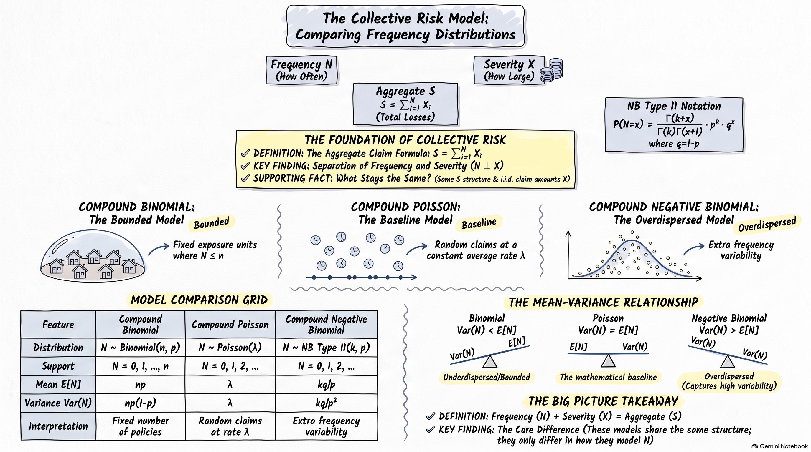

### From Compound Poisson to Compound Negative Binomial

In the collective risk model,

$$
S=\sum_{i=1}^{N}X_i,
$$

the aggregate loss depends on two components:

* the **claim frequency** $N$;
* the **claim severity** $X$.

In the compound Poisson model, the number of claims is assumed to follow

$$
N\sim\operatorname{Poisson}(\lambda).
$$

The Poisson distribution has the important property

$$
E[N]=\operatorname{Var}(N)=\lambda.
$$

This means that the mean and variance of the claim count are necessarily equal.

#### Why Consider the Negative Binomial Distribution?

In practice, claim-count data can exhibit **overdispersion**, meaning that the observed variability in claim counts is greater than their average:

$$
\operatorname{Var}(N)>E[N].
$$

The Poisson model cannot represent this feature because it requires

$$
\operatorname{Var}(N)=E[N].
$$

A more flexible frequency model is therefore useful when the claim-count variance is substantially larger than the claim-count mean.

The **Negative Binomial distribution** provides one such model. Under the IFoA **Type 2** convention,

$$
N\sim NB(k,p),
$$

where $N$ represents the number of failures before the $k$th success.

For this parameterisation,

$$
E[N]=\frac{kq}{p},
\qquad
\operatorname{Var}(N)=\frac{kq}{p^2},
\qquad
q=1-p.
$$

Consequently,

$$
\operatorname{Var}(N)
=
\frac{kq}{p^2}
>
\frac{kq}{p}
=
E[N],
$$

because $0<p<1$.

Thus, unlike the Poisson distribution, the Negative Binomial distribution naturally allows **overdispersion in claim frequency**.

#### From Frequency to Aggregate Loss

Replacing the Poisson frequency distribution with a Negative Binomial distribution gives the collective risk model

$$
S=\sum_{i=1}^{N}X_i,
\qquad
N\sim NB(k,p).
$$

The resulting aggregate loss $S$ is called a **compound negative binomial distribution**.

The model retains the same collective risk structure as the compound Poisson model, but uses a more flexible distribution for the number of claims.

The main progression is therefore

$$
\text{Compound Poisson}
\quad\longrightarrow\quad
\text{Overdispersed claim counts}
\quad\longrightarrow\quad
\text{Compound Negative Binomial}.
$$


:::{#exm-frequency-model-comparison}
## Comparing Poisson and Negative Binomial Frequency Models

Consider a portfolio for which the claim number has been observed for
10,000 policy-years.

The observed claim-count data are summarised below.

| Number of claims | Observed frequency | Proportion |
|-----------------:|-------------------:|-----------:|
| 0 | 8,959 | 0.8959 |
| 1 | 852 | 0.0852 |
| 2 | 160 | 0.0160 |
| 3 | 24 | 0.0024 |
| 4 | 5 | 0.0005 |
| 5+ | 0 | 0.0000 |
| **Total** | **10,000** | **1.0000** |

The sample mean and variance of the number of claims are

$$
\bar{N}=0.1264,
\qquad
s_N^2=0.1628.
$$

Notice that

$$
s_N^2>\bar{N}.
$$

Thus, the observed claim counts exhibit **overdispersion**.

Suppose we fit two candidate frequency models:

1. a Poisson distribution;
2. a Negative Binomial Type 2 distribution.

For the Poisson model,

$$
N\sim\operatorname{Poisson}(\lambda),
$$

so the method of moments estimate is

$$
\hat{\lambda}=\bar{N}=0.1264.
$$

For the Negative Binomial Type 2 model,

$$
N\sim NB(k,p),
$$

where $N$ counts the number of failures before the $k$th success. Its moments are

$$
E[N]=\frac{kq}{p},
\qquad
\operatorname{Var}(N)=\frac{kq}{p^2},
\qquad
q=1-p.
$$

Matching these moments to the sample mean and variance gives estimates of
$k$ and $p$.

Using the fitted models, we can compare the **estimated number of
policy-years having each claim count** with the observed frequencies.

|    Claims |   Observed | Negative Binomial |    Poisson |
| --------: | ---------: | ----------------: | ---------: |
|         0 |      8,959 |           8,948.7 |    8,812.6 |
|         1 |        852 |             878.2 |    1,113.9 |
|         2 |        160 |             141.3 |       70.4 |
|         3 |         24 |              25.7 |        3.0 |
|         4 |          5 |               4.9 |        0.1 |
|        5+ |          0 |               1.2 |        0.0 |
| **Total** | **10,000** |        **10,000** | **10,000** |


The two fitted models have the same estimated mean claim frequency,

$$
E[N]\approx0.1264,
$$

but they distribute the probability differently across the possible
claim counts.

The Poisson model has

$$
\operatorname{Var}(N)=E[N],
$$

whereas the fitted Negative Binomial model allows

$$
\operatorname{Var}(N)>E[N].
$$

The difference is particularly visible in the estimated number of
policy-years with one or more claims. The Negative Binomial model places
more probability on claim counts above zero while allowing greater
variability in the frequency distribution.

This example illustrates why the choice of frequency distribution matters
before constructing the aggregate loss model.

In the following sections, we therefore develop the **compound Negative
Binomial distribution**, in which the claim number follows a Negative
Binomial Type 2 distribution and the claim amounts follow a separate
severity distribution.

:::


### Compound Negative Binomial Distribution

#### Definition

In the collective risk model,

$$
S=\sum_{i=1}^{N}X_i,
$$

where $N$ represents the number of claims and $X_i$ represents the amount of the $i$th claim.

For the **Negative Binomial Type 2** parameterisation used by the IFoA, let

$$
N\sim NB(k,p),
$$

where $N$ counts the number of **failures before the $k$th success**. The parameters satisfy

$$
k>0,\qquad 0<p<1,\qquad q=1-p.
$$

The probability function is

$$
\Pr(N=n)
=
\frac{\Gamma(k+n)}
{\Gamma(k)\Gamma(n+1)}
p^kq^n,
\qquad n=0,1,2,\ldots
$$

The claim amounts are assumed to be independent and identically distributed:

$$
X_1,X_2,\ldots\overset{\text{i.i.d.}}{\sim}F_X,
$$

and independent of $N$.

The aggregate claims are therefore

$$
S=\sum_{i=1}^{N}X_i.
$$

We call $S$ a **compound negative binomial random variable** and write

$$
S\sim\mathcal{CNB}(k,p,F_X).
$$

The model has two components:

* $N\sim NB(k,p)$ describes **claim frequency**;
* $F_X$ describes **claim severity**.

Thus, the compound negative binomial model allows the frequency and severity components to be modelled separately.

#### Mean

For a random sum,

$$
E[S]=E[N]E[X].
$$

Let

$$
m_1=E[X].
$$

Under the Negative Binomial Type 2 parameterisation,

$$
E[N]=\frac{kq}{p}.
$$

Therefore,

$$
\boxed{
E[S]=\frac{kq}{p}m_1
}
$$

The expected aggregate loss is therefore determined by two quantities:

$$
\underbrace{\frac{kq}{p}}_{\text{expected number of claims}}
\qquad\text{and}\qquad
\underbrace{m_1}_{\text{expected claim amount}}.
$$

In other words,

$$
\text{Expected aggregate loss}
=
\text{Expected frequency}
\times
\text{Expected severity}.
$$

#### Variance

For a random sum,

$$
\operatorname{Var}(S)
=
E[N]\operatorname{Var}(X)
+
\operatorname{Var}(N)(E[X])^2.
$$

Let

$$
m_1=E[X],
\qquad
m_2=E[X^2].
$$

Since

$$
\operatorname{Var}(X)=m_2-m_1^2,
$$

and, for the Negative Binomial Type 2 distribution,

$$
E[N]=\frac{kq}{p},
\qquad
\operatorname{Var}(N)=\frac{kq}{p^2},
$$

we obtain

$$
\operatorname{Var}(S)
=
\frac{kq}{p}(m_2-m_1^2)
+
\frac{kq}{p^2}m_1^2.
$$

After simplification,

$$
\boxed{
\operatorname{Var}(S)
=
\frac{kq}{p^2}
\left(
pm_2+qm_1^2
\right)
}
$$

The variance contains contributions from both sources of aggregate-loss uncertainty:

$$
\operatorname{Var}(S)
=
\underbrace{E[N]\operatorname{Var}(X)}
_{\text{severity variation}}
+
\underbrace{\operatorname{Var}(N)(E[X])^2}
_{\text{frequency variation}}.
$$

Thus, uncertainty in the number of claims and uncertainty in the size of individual claims both contribute to the variability of aggregate claims.

#### Coefficient of Skewness

The **coefficient of skewness** is defined as

$$
\gamma_1
=
\frac{E[(S-E[S])^3]}
{\operatorname{Var}(S)^{3/2}}.
$$

For a compound distribution, the third central moment of the aggregate loss is

$$
\mu_{3,S}
=
E[N]\mu_3
+
3\operatorname{Var}(N)m_1\operatorname{Var}(X)
+
\mu_{3,N}m_1^3,
$$

where

$$
\mu_3=E[(X-m_1)^3]
$$

is the third central moment of the severity distribution and

$$
\mu_{3,N}=E[(N-E[N])^3]
$$

is the third central moment of the frequency distribution.

For the Negative Binomial Type 2 distribution,

$$
\mu_{3,N}
=
\frac{kq(1+q)}{p^3}.
$$

Therefore,

$$
\mu_{3,S}
=
\frac{kq}{p}\mu_3
+
3\frac{kq}{p^2}m_1\operatorname{Var}(X)
+
\frac{kq(1+q)}{p^3}m_1^3.
$$

Hence, the coefficient of skewness is

$$
\boxed{
\gamma_{1,S}
=
\frac{
\displaystyle
\frac{kq}{p}\mu_3
+
3\frac{kq}{p^2}m_1\operatorname{Var}(X)
+
\frac{kq(1+q)}{p^3}m_1^3
}{
\left[
\displaystyle
\frac{kq}{p^2}
\left(pm_2+qm_1^2\right)
\right]^{3/2}
}
}
$$

This expression shows that aggregate skewness depends on **both frequency and severity**.

In particular:

* the first term reflects skewness in the claim severity;
* the second term reflects the interaction between frequency variation and severity variation;
* the third term reflects the skewness of the negative binomial claim-count distribution.

Therefore, even when the severity distribution is relatively symmetric, the aggregate loss distribution can remain positively skewed because the claim-count distribution itself is overdispersed and right-skewed.


::: {.callout-note}
## Rewriting $\mu_{3,S}$ in Terms of Raw Moments

The formula for the third central moment of aggregate claims,

$$
\mu_{3,S}
=
\frac{kq}{p}\mu_3
+
3\frac{kq}{p^2}m_1\operatorname{Var}(X)
+
\frac{kq(1+q)}{p^3}m_1^3,
$$

can be rewritten entirely in terms of the raw severity moments by using the identities:

* **Variance expansion:** $\operatorname{Var}(X) = m_2 - m_1^2$
* **Third central moment:** $\mu_3 = m_3 - 3m_1m_2 + 2m_1^3$
* **Parameter identity:** $1-p=q$, so $1+q=2-p$

Substituting these into $\mu_{3,S}$ and simplifying gives

$$
\mu_{3,S}
=
\frac{3kq^2m_1m_2}{p^2}
+
\frac{2kq^3m_1^3}{p^3}
+
\frac{kqm_3}{p}.
$$

This raw-moment form is often more convenient in actuarial calculations because it uses the raw severity moments $m_1$, $m_2$, and $m_3$ directly.

:::


### Worked Example

:::{#exm-compound-negative-binomial-gamma}

## Compound Negative Binomial Model with Gamma Claim Amounts

Consider a compound negative binomial model in which the annual number of claims follows the Negative Binomial Type II distribution

$$
N\sim NB(k,p),
$$

with

$$
k=4,
\qquad
p=0.5,
\qquad
q=1-p=0.5.
$$

Suppose the individual claim amounts are independent of $N$ and have a Gamma distribution with shape parameter $2$ and rate parameter $0.002$:

$$
X_i\sim\operatorname{Gamma}(2,0.002).
$$

The aggregate claims are given by

$$
S=\sum_{i=1}^{N}X_i.
$$

We want to derive $E[X]$ and $\operatorname{Var}(S)$.

:::


**Solution**

Using the shape-rate parameterisation, the first two moments of the claim severity are

$$
m_1=E[X]
=
\frac{\text{shape}}{\text{rate}}
=
\frac{2}{0.002}
=
1{,}000
$$

and

$$
m_2=E[X^2]
=
\frac{\text{shape}(\text{shape}+1)}
{\text{rate}^2}
=
\frac{2(3)}{0.002^2}
=
1{,}500{,}000.
$$

Let

$$
S=\sum_{i=1}^{N}X_i
$$

denote the annual aggregate claim amount.

The expected number of claims is

$$
E[N]
=
\frac{kq}{p}
=
\frac{4(0.5)}{0.5}
=
4.
$$

Thus, the portfolio is expected to have **4 claims per year** on average.

The variance of the number of claims is

$$
\operatorname{Var}(N)
=
\frac{kq}{p^2}
=
\frac{4(0.5)}{0.5^2}
=
8.
$$

Notice that

$$
\operatorname{Var}(N)=8>E[N]=4.
$$

This illustrates the overdispersion allowed by the Negative Binomial model.

For the aggregate loss, the mean is

$$
E[S]
=
\frac{kq}{p}m_1.
$$

Hence,

$$
E[S]
=
4(1{,}000)
=
4{,}000.
$$

The expected annual aggregate claim amount is therefore $4{,}000$.

The variance of aggregate claims is

$$
\operatorname{Var}(S)
=
\frac{kq}{p^2}
\left(
pm_2+qm_1^2
\right).
$$

Substituting the values gives

$$
\begin{aligned}
\operatorname{Var}(S)
&=
8\left[
0.5(1{,}500{,}000)
+
0.5(1{,}000)^2
\right]\\
&=
8\left[
750{,}000+500{,}000
\right]\\
&=
10{,}000{,}000.
\end{aligned}
$$

Thus,

$$
\boxed{
E[S]=4{,}000,
\qquad
\operatorname{Var}(S)=10{,}000{,}000
}
$$

This example illustrates the two levels of variability in the compound model. The number of claims varies from year to year, and the individual claim amounts also vary from claim to claim. Both sources contribute to the variability of aggregate claims.

### Simulation of the Compound Negative Binomial Model

The compound negative binomial model can be simulated in two stages.

First, simulate the annual number of claims:

$$
N\sim NB(k,p).
$$

Then, conditional on the simulated value of $N$, generate the individual claim amounts:

$$
X_1,\ldots,X_N\overset{\text{i.i.d.}}{\sim}F_X.
$$

The aggregate claim amount for that simulated year is then

$$
S=\sum_{i=1}^{N}X_i.
$$

Repeating this procedure many times produces a simulated sample from the compound negative binomial distribution.

For example, suppose we simulate $5{,}000$ insurance years using the parameters from the worked example.

```{r}
set.seed(123)

k <- 4
p <- 0.5
q <- 1 - p

shape <- 2
rate <- 0.002

n_sim <- 5000
```

The claim counts can be simulated using `rnbinom()`. In R, the arguments `size` and `prob` correspond to $k$ and $p$ in the Negative Binomial Type 2 parameterisation used here.

```{r}
N <- rnbinom(
  n_sim,
  size = k,
  prob = p
)
```

Thus, each element of `N` represents the number of claims in one simulated insurance year.

The claim amounts can then be generated conditional on the simulated number of claims. For each year, we generate the required number of Gamma claim amounts and add them together.

```{r}
S <- sapply(N, function(n) {
  if (n == 0) return(0)
  
  sum(rgamma(
    n,
    shape = shape,
    rate = rate
  ))
})
```

Each element of `S` is therefore one simulated annual aggregate claim amount:

$$
S_j=\sum_{i=1}^{N_j}X_{ij},
\qquad
j=1,\ldots,5{,}000.
$$

The simulation produces a sample from the compound negative binomial distribution rather than directly generating aggregate losses from a single standard distribution.

#### Simulated Claim Numbers

The simulated claim counts can be displayed using a histogram.

```{r}
hist(
  N,
  breaks = seq(-0.5, max(N) + 0.5, 1),
  main = "Simulated Claim Numbers",
  xlab = "Number of claims, N",
  ylab = "Frequency"
)
```

The distribution includes the possibility of zero claims and has greater variability than a Poisson distribution with the same mean.

For the model used here,

$$
E[N]=4
$$

and

$$
\operatorname{Var}(N)=8.
$$

The simulated sample should therefore exhibit a mean close to $4$ and a variance close to $8$.

#### Simulated Aggregate Claims

The simulated aggregate losses can be displayed using a histogram.

```{r}
hist(
  S,
  breaks = 50,
  main = "Simulated Aggregate Claims",
  xlab = "Aggregate claim amount, S",
  ylab = "Frequency"
)
```

The distribution of $S$ is right-skewed. This is a consequence of the variability in both the claim frequency and the claim severity.

There is also positive probability of zero aggregate claims, corresponding to years in which

$$
N=0.
$$

#### Comparing Simulation with Theory

The theoretical severity moments can be calculated directly from the Gamma distribution:

```{r}
m1 <- shape / rate
m2 <- shape * (shape + 1) / rate^2
```

These moments can then be substituted into the compound negative binomial formulas.

```{r}
theory_mean <- k * q / p * m1

theory_var <- k * q / p^2 *
  (p * m2 + q * m1^2)
```

We can compare the theoretical results with the corresponding simulated quantities.

```{r}
data.frame(
  Measure = c("Mean", "Variance"),
  Simulation = c(mean(S), var(S)),
  Theory = c(theory_mean, theory_var)
)
```

For the theoretical model,

$$
E[S]=4{,}000
$$

and

$$
\operatorname{Var}(S)=10{,}000{,}000.
$$

With $5{,}000$ simulated insurance years, the simulated mean and variance will generally not be exactly equal to these values. They should, however, be reasonably close.

For example, using the simulation with `set.seed(123)` gives approximately:

| Measure  |  Simulation |     Theory |
| -------- | ----------: | ---------: |
| Mean     |     3,926.8 |      4,000 |
| Variance | 9,437,849.2 | 10,000,000 |

The differences are due to **simulation variability**. The theoretical quantities describe the distribution of the aggregate loss, whereas the simulated quantities are calculated from a finite sample of $5{,}000$ simulated insurance years.

Increasing the number of simulated years would generally make the simulation results more stable and closer to the theoretical values.

The simulation therefore provides a numerical illustration of the compound negative binomial formulas:

$$
E[S]
=
\frac{kq}{p}m_1
$$

and

$$
\operatorname{Var}(S)
=
\frac{kq}{p^2}
\left(
pm_2+qm_1^2
\right).
$$


### Compound Binomial Distribution

#### From Individual Policies to Aggregate Loss

Insurance companies are often interested not only in the claim amount arising from a single policy, but in the **total amount of claims generated by an entire portfolio** during a specified period.

Consider a portfolio of $n$ independent and identical policies. Suppose that, during the period under consideration, each policy can produce **at most one claim**.

For each policy, there are therefore two possible outcomes:

* the policy produces no claim;
* the policy produces one claim.

Let $p$ denote the probability that a particular policy produces a claim. Then the probability of no claim is $1-p$.

If $N$ denotes the total number of claims in the portfolio, then

$$
N\sim\operatorname{Binomial}(n,p).
$$

The binomial distribution is therefore a natural frequency model when there is a **fixed number of potential claim events** and each potential event can occur at most once.

The aggregate claim amount, however, depends not only on how many claims occur but also on the amount of each claim. This leads to the compound binomial model.

#### Why the Binomial Distribution?

The binomial frequency model is appropriate when the following assumptions are reasonable:

1. There are a fixed number $n$ of policies or potential claim events.
2. Each policy can produce at most one claim during the period.
3. Each policy has the same probability $p$ of producing a claim.
4. Claim events for different policies are independent.

Under these assumptions,

$$
N\sim\operatorname{Binomial}(n,p),
$$

with probability mass function

$$
P(N=k)
=
\binom{n}{k}p^k(1-p)^{n-k},
\qquad k=0,1,\ldots,n.
$$

An important feature of this model is that the number of claims has a fixed upper bound:

$$
0\leq N\leq n.
$$

For example, if there are $1{,}000$ policies, there cannot be more than $1{,}000$ claims under the assumption that each policy can produce at most one claim.

#### Frequency and Severity

The random variable $N$ describes the **frequency** of claims: how many claims occur.

To describe the total amount paid, we also need a **severity** model.

Let

$$
X_i
$$

denote the amount of the $i$th claim. Assume that

$$
X_1,X_2,\ldots
$$

are i.i.d. and independent of $N$.

The aggregate claim amount is then

$$
S=\sum_{i=1}^{N}X_i.
$$

The number of terms in this sum is random because $N$ is random.

For example:

* if $N=0$, then $S=0$;
* if $N=1$, then $S=X_1$;
* if $N=2$, then $S=X_1+X_2$;
* if $N=3$, then $S=X_1+X_2+X_3$.

Thus, the aggregate loss is a **random sum**.

This gives the basic structure of the collective risk model:

$$
\boxed{
\text{Frequency}
\quad+\quad
\text{Severity}
\quad\longrightarrow\quad
\text{Aggregate loss}.
}
$$

The frequency component determines **how many claims occur**, while the severity component determines **how much each claim costs**.


### The Compound Binomial Model

#### Definition

Suppose that

$$
N\sim\operatorname{Binomial}(n,p),
$$

and that the claim amounts

$$
X_1,X_2,\ldots
$$

are i.i.d. and independent of $N$.

The aggregate claim amount

$$
\boxed{
S=\sum_{i=1}^{N}X_i
}
$$

is said to have a **compound binomial distribution**.

We may write

$$
\boxed{
S\sim\mathcal{CB}(n,p,F_X),
}
$$

where $F_X$ denotes the distribution of an individual claim amount.

The three quantities $(n,p,F_X)$ therefore determine the model:

* $n$ describes the number of potential claim events;
* $p$ describes the probability of a claim for each policy;
* $F_X$ describes the distribution of the amount of an individual claim.

#### Conditional Interpretation

A useful way to understand the compound binomial distribution is to condition on the number of claims.

If

$$
N=k,
$$

then the aggregate claim amount is

$$
S=X_1+\cdots+X_k.
$$

Therefore, conditional on $N=k$, the aggregate loss is the sum of $k$ independent severity variables.

In particular,

$$
S\mid N=k
\overset{d}{=}
X_1+\cdots+X_k.
$$

Consequently, the distribution of $S$ can be viewed as a mixture of the distributions corresponding to different possible values of $N$.

This is the origin of the word **compound**: the aggregate distribution is constructed by combining the frequency distribution with the severity distribution.

#### Probability of Zero Claims

The binomial frequency model also gives an immediate expression for the probability of no claims:

$$
P(N=0)
=
(1-p)^n.
$$

If claim amounts are strictly positive, then

$$
S=0
\quad\Longleftrightarrow\quad
N=0.
$$

Therefore,

$$
\boxed{
P(S=0)=(1-p)^n.
}
$$

This is an important difference between an aggregate loss distribution and an individual claim-size distribution. The aggregate loss has a **point mass at zero** because the portfolio may experience no claims during the period.


#### Moments of the Aggregate Loss

#### Mean

For a random sum

$$
S=\sum_{i=1}^{N}X_i,
$$

where $N$ is independent of the severity variables, the expected value is

$$
E[S]=E[N]E[X].
$$

For the binomial frequency distribution,

$$
E[N]=np.
$$

Let

$$
m_1=E[X].
$$

Then

$$
\begin{aligned}
E[S]
&=E[N]E[X]\\
&=(np)m_1.
\end{aligned}
$$

Hence,

$$
\boxed{
E[S]=npm_1.
}
$$

This result has a particularly simple interpretation:

$$
\boxed{
E[S]
=
\underbrace{np}_{\text{expected number of claims}}
\underbrace{m_1}_{\text{expected claim amount}}.
}
$$

Thus, the expected aggregate loss is the expected number of claims multiplied by the expected amount of an individual claim.

For example, suppose

$$
n=10{,}000,
\qquad
p=0.02,
$$

and

$$
E[X]=50{,}000.
$$

Then the expected number of claims is

$$
E[N]=10{,}000(0.02)=200,
$$

and consequently

$$
E[S]
=
200(50{,}000)
=
10{,}000{,}000.
$$

The expected aggregate loss is therefore $10$ million.

The calculation illustrates an important modelling principle: **the mean aggregate loss can be understood through the two separate components of the model**.


#### Variance

The variance of a random sum is

$$
\operatorname{Var}(S)
=
E[N]\operatorname{Var}(X)
+
\operatorname{Var}(N)\{E[X]\}^2.
$$

For the binomial distribution,

$$
E[N]=np
$$

and

$$
\operatorname{Var}(N)=np(1-p).
$$

Let

$$
m_1=E[X]
$$

and

$$
m_2=E[X^2].
$$

Since

$$
\operatorname{Var}(X)=m_2-m_1^2,
$$

we obtain

$$
\begin{aligned}
\operatorname{Var}(S)
&=
np(m_2-m_1^2)
+
np(1-p)m_1^2.
\end{aligned}
$$

Expanding,

$$
\begin{aligned}
\operatorname{Var}(S)
&=
npm_2-npm_1^2
+
np(1-p)m_1^2\\
&=
npm_2-npm_1^2
+npm_1^2-np^2m_1^2\\
&=
npm_2-np^2m_1^2.
\end{aligned}
$$

Therefore,

$$
\boxed{
\operatorname{Var}(S)
=
npm_2-np^2m_1^2.
}
$$

Equivalently,

$$
\boxed{
\operatorname{Var}(S)
=
np\operatorname{Var}(X)
+
np(1-p)\{E[X]\}^2.
}
$$

The latter expression provides an important interpretation.

The first component,

$$
np\operatorname{Var}(X),
$$

represents uncertainty arising from **variation in claim sizes**.

The second component,

$$
np(1-p)\{E[X]\}^2,
$$

represents uncertainty arising from **variation in the number of claims**.

Thus,

$$
\boxed{
\text{Aggregate uncertainty}
=
\text{severity uncertainty}
+
\text{frequency uncertainty}.
}
$$

This decomposition is one of the most useful ways to interpret the variance of a collective risk model.


#### Third Central Moment and Coefficient of Skewness

The mean and variance describe the centre and spread of the aggregate loss distribution. However, insurance loss distributions are often asymmetric, with a relatively long right tail.

The **coefficient of skewness** measures this asymmetry.

For a random variable $Y$, define

$$
\gamma_1(Y)
=
\frac{E[(Y-E[Y])^3]}
{\{\operatorname{Var}(Y)\}^{3/2}}.
$$

For the severity distribution, define the raw moments

$$
m_1=E[X],
\qquad
m_2=E[X^2],
\qquad
m_3=E[X^3].
$$

For the compound binomial model, the third central moment of the aggregate loss is

$$
\boxed{
\mu_3(S)
=
np\left[
m_3-3pm_1m_2+2p^2m_1^3
\right].
}
$$

Therefore, the coefficient of skewness is

$$
\boxed{
\gamma_1(S)
=
\frac{
np\left[
m_3-3pm_1m_2+2p^2m_1^3
\right]
}{
\left(
npm_2-np^2m_1^2
\right)^{3/2}
}.
}
$$

A positive value of $\gamma_1(S)$ indicates right-skewness.

This is common for insurance aggregate losses because unusually large claims can produce aggregate losses far above the mean.

The skewness therefore gives information that cannot be obtained from the mean and variance alone.


#### A Useful Interpretation of Skewness

The third central moment can also be written as

$$
\begin{aligned}
\mu_3(S)
&=
np\mu_{3,X}
+
3np(1-p)\mu_X\sigma_X^2\\
&\quad
+
np(1-p)(1-2p)\mu_X^3,
\end{aligned}
$$

where

$$
\mu_X=E[X],
$$

$$
\sigma_X^2=\operatorname{Var}(X),
$$

and

$$
\mu_{3,X}
=
E[(X-\mu_X)^3].
$$

This expression shows that aggregate skewness is influenced by both:

* the skewness of the individual claim amounts;
* the randomness in the number of claims.

Therefore, even if individual claims were not particularly skewed, randomness in claim frequency could still contribute to aggregate skewness.


#### The MGF of the Compound Binomial Distribution

The moment generating function provides another way to construct and analyse the compound binomial distribution.

Let

$$
M_X(t)=E[e^{tX}]
$$

be the MGF of the individual claim amount.

Conditional on $N=k$,

$$
S=X_1+\cdots+X_k.
$$

Since the $X_i$ are independent,

$$
\begin{aligned}
M_{S\mid N=k}(t)
&=
E[e^{t(X_1+\cdots+X_k)}]\\
&=
\prod_{i=1}^{k}E[e^{tX_i}]\\
&=
[M_X(t)]^k.
\end{aligned}
$$

We now average over the possible values of $N$:

$$
\begin{aligned}
M_S(t)
&=
E[M_X(t)^N].
\end{aligned}
$$

The probability generating function of a binomial random variable is

$$
G_N(z)
=
(1-p+pz)^n.
$$

Setting

$$
z=M_X(t)
$$

gives

$$
\boxed{
M_S(t)
=
[1-p+pM_X(t)]^n.
}
$$

Writing

$$
q=1-p,
$$

we may also write

$$
\boxed{
M_S(t)
=
[q+pM_X(t)]^n.
}
$$

This formula is the compound binomial counterpart of the general random-sum MGF relationship.


### Worked Example: Compound Binomial with Gamma Severity

:::{#exm-compound-binomial-gamma}

## Compound Binomial Model with Gamma Claim Amounts

Consider a portfolio with

$$
n=100
$$

policies, where each policy has probability

$$
p=0.01
$$

of producing a claim.

Thus,

$$
N\sim\operatorname{Binomial}(100,0.01).
$$

Suppose that, independently of $N$,

$$
X_i\overset{\text{i.i.d.}}{\sim}\operatorname{Gamma}(20,0.1),
$$

where the Gamma distribution uses the **shape-rate parameterisation**.

Let

$$
S=\sum_{i=1}^{N}X_i.
$$

We will determine:

1. the MGF of $S$;
2. $E[S]$;
3. $\operatorname{Var}(S)$;
4. the coefficient of skewness;
5. $P(S=0)$.

:::

**Solution**

#### Moments of the Gamma Severity

For

$$
X\sim\operatorname{Gamma}(\alpha,\lambda),
$$

under the shape-rate parameterisation,

$$
E[X]=\frac{\alpha}{\lambda}
$$

and

$$
\operatorname{Var}(X)=\frac{\alpha}{\lambda^2}.
$$

Therefore,

$$
E[X]
=
\frac{20}{0.1}
=
200.
$$

Thus,

$$
m_1=200.
$$

The variance is

$$
\operatorname{Var}(X)
=
\frac{20}{0.1^2}
=
2{,}000.
$$

Hence,

$$
\begin{aligned}
m_2
&=E[X^2]\\
&=\operatorname{Var}(X)+\{E[X]\}^2\\
&=2{,}000+200^2\\
&=42{,}000.
\end{aligned}
$$

For the third raw moment of a Gamma random variable,

$$
E[X^3]
=
\frac{\alpha(\alpha+1)(\alpha+2)}
{\lambda^3}.
$$

Thus,

$$
m_3
=
\frac{20(21)(22)}{0.1^3}
=
9{,}240{,}000.
$$

Therefore,

$$
\boxed{
m_1=200,\qquad
m_2=42{,}000,\qquad
m_3=9{,}240{,}000.
}
$$

#### MGF of the Aggregate Loss

For the Gamma severity,

$$
M_X(t)
=
\left(
\frac{0.1}{0.1-t}
\right)^{20},
\qquad t<0.1.
$$

Using the compound binomial MGF,

$$
M_S(t)
=
[1-p+pM_X(t)]^n.
$$

Substituting $n=100$ and $p=0.01$ gives

$$
\boxed{
M_S(t)
=
\left[
0.99+
0.01
\left(
\frac{0.1}{0.1-t}
\right)^{20}
\right]^{100}.
}
$$

This single expression describes the distribution of the aggregate claim amount.

#### Expected Aggregate Loss

The expected number of claims is

$$
E[N]=np=100(0.01)=1.
$$

Therefore,

$$
\begin{aligned}
E[S]
&=npm_1\\
&=100(0.01)(200)\\
&=200.
\end{aligned}
$$

Hence,

$$
\boxed{
E[S]=200.
}
$$

The interpretation is straightforward: on average, one claim occurs and each claim has expected amount $200$.

#### Variance of the Aggregate Loss

Using

$$
\operatorname{Var}(S)
=
npm_2-np^2m_1^2,
$$

we obtain

$$
\begin{aligned}
\operatorname{Var}(S)
&=
100(0.01)(42{,}000)
-
100(0.01)^2(200)^2\\
&=
42{,}000-400\\
&=
41{,}600.
\end{aligned}
$$

Thus,

$$
\boxed{
\operatorname{Var}(S)=41{,}600.
}
$$

The standard deviation is

$$
\operatorname{SD}(S)
=
\sqrt{41{,}600}
\approx203.96.
$$

The standard deviation is quite large relative to the mean because the Gamma severity distribution allows substantial variation in claim amounts.

#### Coefficient of Skewness

Using

$$
\gamma_1(S)
=
\frac{
np\left[
m_3-3pm_1m_2+2p^2m_1^3
\right]
}{
\left(
npm_2-np^2m_1^2
\right)^{3/2}
},
$$

we obtain

$$
\begin{aligned}
\gamma_1(S)
&=
\frac{
100(0.01)
\left[
9{,}240{,}000
-3(0.01)(200)(42{,}000)
+2(0.01)^2(200)^3
\right]
}{
(41{,}600)^{3/2}
}\\
&\approx1.060.
\end{aligned}
$$

Hence,

$$
\boxed{
\gamma_1(S)\approx1.06.
}
$$

The positive skewness indicates that the aggregate-loss distribution has a longer right tail than left tail.

#### Probability of Zero Aggregate Loss

Because the claim amounts are positive,

$$
S=0
\quad\Longleftrightarrow\quad
N=0.
$$

Therefore,

$$
\begin{aligned}
P(S=0)
&=P(N=0)\\
&=(1-p)^n\\
&=(0.99)^{100}\\
&\approx0.3660.
\end{aligned}
$$

Thus,

$$
\boxed{
P(S=0)\approx0.3660.
}
$$

There is approximately a $36.6%$ probability that the portfolio generates no claims during the period.


### Simulation of the Collective Risk Model

The collective risk model can be studied not only through analytical calculations but also through **simulation**. Simulation allows us to generate many possible insurance years and use the simulated aggregate losses to approximate quantities such as the mean, variance, and distribution of the aggregate claim amount.

Consider the compound binomial model

$$
N\sim\operatorname{Binomial}(100,0.01),
$$

where $N$ represents the number of claims during one year, and suppose that the individual claim amounts are independent and identically distributed as

$$
X_i\overset{\text{i.i.d.}}{\sim}\operatorname{Gamma}(20,0.1),
$$

where the Gamma distribution is parameterised by shape and rate.

The aggregate claim amount is

$$
S=\sum_{i=1}^{N}X_i.
$$

The simulation therefore follows the same structure as the collective risk model:

$$
N
\longrightarrow
X_1,\ldots,X_N
\longrightarrow
S.
$$

#### Simulating the Collective Risk Model

The simulation can be carried out in two stages.

1. **Simulate the number of claims $N$.**
2. **For each simulated year, simulate the corresponding claim amounts and calculate the aggregate loss $S$.**

We repeat these two steps many times to generate a large sample of possible aggregate losses.

Suppose that we simulate

$$
B=100{,}000
$$

insurance years. Each simulated year represents one possible realisation of the collective risk model.

#### Stage 1: Simulating the Number of Claims

For each simulated year, generate the number of claims from the frequency distribution

$$
N\sim\operatorname{Binomial}(100,0.01).
$$

In R, this can be done using `rbinom()`:

```{r}
set.seed(123)

B <- 100000

N <- rbinom(
  B,
  size = 100,
  prob = 0.01
)
```

The vector `N` contains $B$ simulated numbers of claims. Thus, each element of `N` represents the number of claims in one simulated year.

For example,

```{r}
head(N)
```

might produce a sequence such as

```text
[1] 0 2 1 2 3 0
```

The particular values depend on the random simulation, but each value is generated from the specified binomial distribution.

Because

$$
E[N]=100(0.01)=1,
$$

we expect the simulated number of claims to be centred around 1 claim per year.

#### Stage 2: Simulating the Aggregate Claim Amount

Once the number of claims has been simulated, we generate the corresponding claim amounts.

Suppose that a particular simulated year has

$$
N=n.
$$

If $n=0$, there are no claims and therefore

$$
S=0.
$$

If $n>0$, we simulate $n$ independent claim amounts,

$$
X_1,\ldots,X_n
\overset{\text{i.i.d.}}{\sim}
\operatorname{Gamma}(20,0.1),
$$

and calculate

$$
S=X_1+\cdots+X_n
=\sum_{i=1}^{n}X_i.
$$

In R, the aggregate loss for each simulated year can therefore be generated using:

```{r}
S <- sapply(N, function(n) {
  if (n == 0) {
    0
  } else {
    sum(rgamma(
      n,
      shape = 20,
      rate = 0.1
    ))
  }
})
```

The vector `S` contains $B=100{,}000$ simulated aggregate losses.

Each element of `S` represents one possible outcome of

$$
S=\sum_{i=1}^{N}X_i.
$$

Notice that the number of Gamma random variables generated is different from one simulated year to another because the number of claims $N$ is itself random.

#### Visualising the Simulated Aggregate Losses

The simulated values of $S$ can be displayed using a histogram.

```{r}

set.seed(123)

B <- 100000

N <- rbinom(
  B,
  size = 100,
  prob = 0.01
)

S <- sapply(N, function(n) {
  if (n == 0) {
    0
  } else {
    sum(rgamma(
      n,
      shape = 20,
      rate = 0.1
    ))
  }
})

hist(
  S,
  breaks = 50,
  main = "Simulated Aggregate Loss",
  xlab = "Aggregate loss, S"
)
```

The histogram provides an empirical approximation to the distribution of the aggregate claim amount $S$.

An important feature is the probability mass at zero. This occurs because

$$
P(N=0)=(1-0.01)^{100},
$$

and whenever there are no claims, the aggregate loss is zero.

#### Estimating the Mean and Variance

The simulated aggregate losses can be used to estimate the moments of $S$.

The sample mean provides an estimate of the expected aggregate claim amount:

$$
\widehat{E[S]}
=
\frac{1}{B}\sum_{j=1}^{B}S_j.
$$

Similarly, the sample variance provides an estimate of the variance:

$$
\widehat{\operatorname{Var}(S)}
=
\frac{1}{B-1}
\sum_{j=1}^{B}
(S_j-\bar S)^2.
$$

In R:

```{r}
mean(S)
var(S)
```

For this simulation, the results are approximately

$$
\widehat{E[S]}=199.89
$$

and

$$
\widehat{\operatorname{Var}(S)}
=41{,}515.39.
$$

We can compare these values with the theoretical results.

Since

$$
E[N]=100(0.01)=1
$$

and, for $N\sim\operatorname{Binomial}(100,0.01)$,

$$
\operatorname{Var}(N)
=
100(0.01)(0.99)
=
0.99,
$$

while for

$$
X\sim\operatorname{Gamma}(20,0.1),
$$

we have

$$
E[X]=\frac{20}{0.1}=200
$$

and

$$
\operatorname{Var}(X)
=
\frac{20}{0.1^2}
=
2000.
$$

Therefore,

$$
E[S]
=
E[N]E[X]
=
1(200)
=
200,
$$

and

$$
\begin{aligned}
\operatorname{Var}(S)
&=
E[N]\operatorname{Var}(X)
+
\operatorname{Var}(N)(E[X])^2\\
&=
1(2000)
+
0.99(200)^2\\
&=
41{,}600.
\end{aligned}
$$

Thus,

$$
\widehat{E[S]}\approx E[S]
$$

and

$$
\widehat{\operatorname{Var}(S)}
\approx
\operatorname{Var}(S).
$$

The small differences arise because the simulation is based on a finite number of simulated insurance years. Increasing $B$ generally makes the simulated estimates closer to the theoretical values.

::: {.callout-note}

## Simulation and theory

Simulation does not replace the theoretical formulas. Instead, it provides a numerical way to verify and explore the model.

In this example,

$$
\widehat{E[S]}\approx E[S]
$$

and

$$
\widehat{\operatorname{Var}(S)}
\approx
\operatorname{Var}(S).
$$

This agreement provides a useful check that the simulation has been implemented correctly.

:::


### From the Compound Binomial Model to the General Collective Risk Model

The compound binomial distribution is an important special case of the general collective risk model

$$
S=\sum_{i=1}^{N}X_i.
$$

The general structure remains the same:

$$
\boxed{
S
=
\underbrace{\sum_{i=1}^{N}}_{\text{random number of claims}}
\underbrace{X_i}_{\text{claim severity}}.
}
$$

What changes from one compound model to another is the distribution chosen for $N$.

For the compound binomial model,

$$
N\sim\operatorname{Binomial}(n,p),
$$

so there is a fixed maximum number of claims:

$$
N\leq n.
$$

This makes the compound binomial model particularly suitable for portfolios in which each individual policy can generate at most one claim.

In contrast, if a policy can generate multiple claims during the period, a different frequency model, such as the Poisson or negative binomial distribution, may be more appropriate.

The compound binomial model therefore provides an important bridge between **individual-policy modelling** and the broader **collective risk model**.


#### Summary

The compound binomial model combines a binomial frequency distribution with a severity distribution.

The frequency model is

$$
N\sim\operatorname{Binomial}(n,p),
$$

and the aggregate loss is

$$
S=\sum_{i=1}^{N}X_i.
$$

If

$$
m_k=E[X^k],
$$

then

$$
\boxed{
E[S]=npm_1
}
$$

and

$$
\boxed{
\operatorname{Var}(S)
=
npm_2-np^2m_1^2.
}
$$

The third central moment is

$$
\boxed{
\mu_3(S)
=
np\left[
m_3-3pm_1m_2+2p^2m_1^3
\right],
}
$$

giving the coefficient of skewness

$$
\boxed{
\gamma_1(S)
=
\frac{
np\left[
m_3-3pm_1m_2+2p^2m_1^3
\right]
}{
\left(
npm_2-np^2m_1^2
\right)^{3/2}
}.
}
$$

The MGF is

$$
\boxed{
M_S(t)
=
[1-p+pM_X(t)]^n.
}
$$

The central modelling idea is that the aggregate loss contains two distinct sources of randomness:

$$
\boxed{
\text{Frequency uncertainty}
+
\text{Severity uncertainty}
=
\text{Aggregate loss uncertainty}.
}
$$

This same framework will be used for other compound distributions, with the principal difference being the choice of the frequency distribution $N$.


### Comparing the Three Frequency Models

The compound binomial, compound Poisson, and compound negative binomial models all describe aggregate claim amounts through the same basic structure,

$$
S=\sum_{i=1}^{N}X_i,
$$

but they use different models for the number of claims $N$.

The choice of frequency distribution determines how the model represents the number of claims that may occur during the observation period.

| Model                      | Frequency distribution            | Support of $N$ | Typical interpretation                                                           |
| -------------------------- | --------------------------------- | -------------- | -------------------------------------------------------------------------------- |
| Compound Binomial          | $\operatorname{Binomial}(n,p)$    | $0,\ldots,n$   | A fixed number of policies, each with a limited probability of producing a claim |
| Compound Poisson           | $\operatorname{Poisson}(\lambda)$ | $0,1,2,\ldots$ | Claims occur independently at an approximately constant average rate             |
| Compound Negative Binomial | $\operatorname{NB}(k,p)$          | $0,1,2,\ldots$ | Claim counts exhibit greater variability than a Poisson model                    |

The severity distribution $F_X$ can be chosen separately from the frequency model. Thus, the same claim severity distribution can be used with all three models.

{#fig-frequency-distributions fig-align="center" width="80%"}

#### Compound Binomial

The compound binomial model is particularly natural when there is a **fixed number of exposure units**, such as a portfolio containing $n$ insurance policies, and each policy can produce at most one claim during the period.

For example, suppose that 1,000 policies are observed for one year and each policy has probability $0.01$ of producing a claim. Then

$$
N\sim\operatorname{Binomial}(1000,0.01).
$$

The model has a natural upper bound:

$$
N\leq n.
$$

This can be an important feature when the underlying insurance mechanism really does impose such a limit.

**Limitation:** the binomial model assumes a fixed number of independent exposure units with the same claim probability. It is therefore less suitable when the number of potential claims is not naturally bounded or when claim events arise through a process rather than through a fixed collection of policies.

#### Compound Poisson

The compound Poisson model is one of the most widely used frequency models in collective risk modelling.

It assumes that the number of claims follows

$$
N\sim\operatorname{Poisson}(\lambda).
$$

The model is appropriate when claims can be viewed as occurring independently over the period at an approximately constant average rate. There is no fixed upper bound on the number of claims.

For example, the number of reported motor insurance claims in a portfolio during a year may be modelled using a Poisson distribution when the usual Poisson assumptions provide a reasonable approximation.

One reason for the importance of the compound Poisson model is its mathematical simplicity. It provides a convenient starting point for modelling aggregate losses and has particularly simple moment and cumulant properties.

**Limitation:** the Poisson distribution imposes the restriction

$$
E[N]=\operatorname{Var}(N).
$$

Consequently, if the observed claim counts show substantially greater variability than their mean, the Poisson model may not provide an adequate representation of the frequency distribution.

#### Compound Negative Binomial

The compound negative binomial model provides an alternative when the claim count is more variable than would be expected under a Poisson model.

In particular, the negative binomial distribution can accommodate

$$
\operatorname{Var}(N)>E[N].
$$

This feature makes the model useful when there is **overdispersion** in the claim counts.

For example, different policyholders may have different underlying risks. Even if claims are approximately Poisson conditional on an underlying risk level, variation in risk between policyholders or groups can produce greater overall variability in the observed claim count. A negative binomial model can capture some of this additional variation.

**Limitation:** the negative binomial model introduces additional parameters and assumptions compared with the Poisson model. It is therefore more flexible, but the extra flexibility should be supported by the data and the modelling context.

#### Choosing Between the Models

The three models can therefore be viewed as representing different levels of modelling structure.

| Question                                            | Compound Binomial              | Compound Poisson                 | Compound Negative Binomial        |
| --------------------------------------------------- | ------------------------------ | -------------------------------- | --------------------------------- |
| Is the number of possible claims naturally bounded? | Yes                            | No                               | No                                |
| Is there a fixed number of exposure units?          | Natural setting                | Not required                     | Not required                      |
| Is the Poisson assumption plausible?                | Not the main issue             | Yes                              | Not necessarily                   |
| Can the model accommodate overdispersion?           | Depending on parameters        | No                               | Yes                               |
| Main modelling idea                                 | Fixed opportunities for claims | Random claims at an average rate | Extra variability in claim counts |

The choice of model should therefore be guided by the **insurance mechanism and the observed claim-count data**, rather than by the mathematical convenience of a particular distribution.

::: {.callout-note}

## A useful way to think about the three models

The three models answer slightly different questions about the claim frequency:

* **Compound Binomial:** *How many of a fixed number of opportunities result in a claim?*
* **Compound Poisson:** *How many claims occur when claims arrive at an approximately constant average rate?*
* **Compound Negative Binomial:** *How many claims occur when the claim count has more variability than a Poisson model can accommodate?*

The severity model then determines **how large those claims are**.

#### The Role of the Severity Distribution

It is important to distinguish the **frequency model** from the **severity model**.

The three models above differ in their assumptions about $N$, but they can use the same distribution for the individual claim amounts $X_i$.

For example, we could have

$$
X_i\sim\operatorname{Gamma}(20,0.1)
$$

under any of the three frequency models.

Thus, the collective risk model has two separate modelling decisions:

$$
\boxed{
\text{Frequency model}
+
\text{Severity model}
\longrightarrow
\text{Aggregate loss model}
}
$$

The frequency model describes **how often claims occur**, while the severity model describes **how large the claims are**.

This distinction becomes particularly important when interpreting insurance data. A model may fit the claim frequency well but fit the claim severity poorly, or vice versa.
:::


## Reinsurance in the Collective Risk Model

### Motivation for Reinsurance

The collective risk model describes the total claims arising from a portfolio during a specified period as

$$
S=\sum_{i=1}^{N}X_i,
$$

where $N$ is the number of claims and $X_i$ is the amount of the $i$th claim.

Although the collective risk model allows an insurer to quantify its aggregate claims, the resulting loss can be highly uncertain. In particular, a small number of large claims may produce a substantial aggregate loss during the period.

**Reinsurance** provides a mechanism through which an insurer transfers part of its claim risk to another insurer, called the **reinsurer**. In return, the insurer pays a reinsurance premium.

The purpose of reinsurance is therefore not to eliminate claims, but to **share the financial consequences of claims between the insurer and the reinsurer**.

Let

$$
S
$$

denote the original aggregate claim amount. After reinsurance, let

$$
S_I
$$

denote the aggregate amount paid by the insurer and

$$
S_R
$$

denote the aggregate amount paid by the reinsurer.

The payments must satisfy

$$
\boxed{S=S_I+S_R}.
$$

Thus, the original aggregate claim is divided between the two parties.

The way in which this division is made depends on the **reinsurance arrangement**.

Two important forms of reinsurance considered in the collective risk model are:

1. **Proportional reinsurance**, where the insurer and reinsurer share every claim according to fixed proportions.
2. **Individual excess-of-loss reinsurance**, where the reinsurer covers the part of an individual claim exceeding a specified retention level.

These two arrangements lead to different transformations of the individual claim amount $X$ and, consequently, different aggregate-loss distributions.


### Proportional Reinsurance

Under proportional reinsurance, the insurer retains a fixed proportion $\alpha$ of every claim, where

$$
0\leq\alpha\leq1.
$$

For an individual claim $X_i$, the insurer pays

$$
Y_i=\alpha X_i,
$$

while the reinsurer pays

$$
Z_i=(1-\alpha)X_i.
$$

Therefore,

$$
X_i=Y_i+Z_i.
$$

Summing over all $N$ claims gives

$$
S_I=\sum_{i=1}^{N}Y_i
=\alpha\sum_{i=1}^{N}X_i
=\alpha S,
$$

and

$$
S_R=\sum_{i=1}^{N}Z_i
=(1-\alpha)\sum_{i=1}^{N}X_i
=(1-\alpha)S.
$$

Hence,

$$
\boxed{S_I=\alpha S,\qquad S_R=(1-\alpha)S}.
$$

An important feature of proportional reinsurance is that **both parties contribute to every claim**. The insurer always pays the same proportion $\alpha$ of the claim, while the reinsurer always pays the remaining proportion $1-\alpha$.

Unless an additional limit is imposed, both parties therefore have liability for claims of any size.

The aggregate claims paid by the insurer and reinsurer are consequently scaled versions of the original aggregate claims.

::: {.callout-note}
## Key Idea

Proportional reinsurance does not change the number of claims $N$. Instead, it changes how the amount of each claim $X_i$ is allocated between the insurer and the reinsurer.

Thus, reinsurance can be incorporated into the collective risk model by transforming the individual claim amounts before constructing the aggregate loss.
:::


### Effect on the Collective Risk Model

The proportional reinsurance arrangement can also be viewed at the individual-claim level.

Originally,

$$
S=\sum_{i=1}^{N}X_i.
$$

After proportional reinsurance, the insurer's individual claim amount is

$$
Y_i=\alpha X_i.
$$

Therefore,

$$
S_I=\sum_{i=1}^{N}Y_i.
$$

The collective risk model has not changed in terms of the claim frequency $N$. Instead, the **severity distribution has been transformed** from $X$ to $Y=\alpha X$.

Similarly, the reinsurer's aggregate claims are generated by the transformed severity

$$
Z=(1-\alpha)X.
$$

Thus,

$$
S_I=\sum_{i=1}^{N}Y_i
\qquad\text{and}\qquad
S_R=\sum_{i=1}^{N}Z_i.
$$

This provides an important general principle for reinsurance:

> **Reinsurance can be incorporated into the collective risk model by transforming the individual claim amounts and then applying the collective model to the transformed severity distribution.**

For proportional reinsurance, the transformation is particularly simple because it is just a scaling transformation.

### Effect on Aggregate Moments

Because

$$
S_I=\alpha S,
$$

the insurer's expected aggregate claims are

$$
E[S_I]
=
\alpha E[S].
$$

Similarly,

$$
E[S_R]
=
(1-\alpha)E[S].
$$

Thus,

$$
\boxed{
E[S_I]=\alpha E[S],
\qquad
E[S_R]=(1-\alpha)E[S]
}.
$$

For the variances, the scaling property gives

$$
\operatorname{Var}(S_I)
=
\alpha^2\operatorname{Var}(S),
$$

and

$$
\operatorname{Var}(S_R)
=
(1-\alpha)^2\operatorname{Var}(S).
$$

Therefore,

$$
\boxed{
\operatorname{Var}(S_I)
=
\alpha^2\operatorname{Var}(S),
\qquad
\operatorname{Var}(S_R)
=
(1-\alpha)^2\operatorname{Var}(S)
}.
$$

These results show that proportional reinsurance reduces the insurer's aggregate-loss variance by a factor of $\alpha^2$.

However, there is an important point concerning the relationship between the insurer and reinsurer.

Since

$$
S_I=\alpha S
\qquad\text{and}\qquad
S_R=(1-\alpha)S,
$$

the two aggregate losses are **not independent**. They are perfectly positively dependent because both are determined by the same original aggregate loss $S$.

Consequently,

$$
\operatorname{Var}(S)
\neq
\operatorname{Var}(S_I)+\operatorname{Var}(S_R)
$$

in general.

Instead,

$$
\operatorname{Var}(S)
=
\operatorname{Var}(S_I)
+
\operatorname{Var}(S_R)
+
2\operatorname{Cov}(S_I,S_R).
$$

This covariance term will be important when decomposing the original aggregate risk between the insurer and reinsurer.


### Worked Example

:::{#exm-proportional-reinsurance}

## Aggregate Claims under Proportional Reinsurance

Suppose aggregate claims follow a compound Poisson model with

$$
N\sim\operatorname{Poisson}(10)
$$

and individual claim amounts

$$
X\sim Pa(4,1),
$$

where the Pareto distribution is parameterised by shape $\alpha$ and scale $\lambda$.

The insurer purchases proportional reinsurance with retention $\alpha_R=0.8$. Thus, the insurer retains $80%$ of every claim and the reinsurer pays the remaining $20%$.

Let $S$ denote the original aggregate claims, $S_I$ the aggregate claims paid by the insurer, and $S_R$ the aggregate claims paid by the reinsurer.

Find:

1. the distributions of $S_I$ and $S_R$;
2. $E[S_I]$ and $E[S_R]$;
3. $\operatorname{Var}(S_I)$ and $\operatorname{Var}(S_R)$;
4. compare $\operatorname{Var}(S_I)+\operatorname{Var}(S_R)$ with $\operatorname{Var}(S)$;
5. explain why the two variances do not add to the original aggregate variance.
:::

**Solution**

The original aggregate claim amount is

$$
S=\sum_{i=1}^{N}X_i.
$$

Under proportional reinsurance with retention $\alpha_R=0.8$,

$$
S_I=0.8S
$$

and

$$
S_R=0.2S.
$$

Equivalently, at the individual-claim level,

$$
Y_i=0.8X_i
$$

for the insurer and

$$
Z_i=0.2X_i
$$

for the reinsurer. Therefore,

$$
S_I=\sum_{i=1}^{N}Y_i,
\qquad
S_R=\sum_{i=1}^{N}Z_i.
$$

Because the claim frequency $N$ remains unchanged, both $S_I$ and $S_R$ are compound Poisson aggregate claims with transformed severity distributions.

For the Pareto parameterisation used here,

$$
X\sim Pa(\alpha,\lambda)
\quad\Longrightarrow\quad
kX\sim Pa(\alpha,k\lambda).
$$

Since

$$
X_i\sim Pa(4,1),
$$

we obtain

$$
Y_i=0.8X_i\sim Pa(4,0.8)
$$

and

$$
Z_i=0.2X_i\sim Pa(4,0.2).
$$

Hence,

$$
\boxed{
S_I\sim\mathcal{CP}(10,Pa(4,0.8))
}
$$

and

$$
\boxed{
S_R\sim\mathcal{CP}(10,Pa(4,0.2))
}.
$$

For $X\sim Pa(4,1)$, the first two moments are

$$
E[X]=\frac{\lambda}{\alpha-1}
=\frac{1}{4-1}
=\frac{1}{3}
$$

and

$$
E[X^2]
=
\frac{2\lambda^2}{(\alpha-1)(\alpha-2)}
=
\frac{2}{(4-1)(4-2)}
=
\frac{1}{3}.
$$

For a compound Poisson model,

$$
E[S]=E[N]E[X]
$$

and

$$
\operatorname{Var}(S)=E[N]E[X^2].
$$

Since $E[N]=10$,

$$
E[S]
=
10\left(\frac{1}{3}\right)
=
\boxed{\frac{10}{3}}
$$

and

$$
\operatorname{Var}(S)
=
10\left(\frac{1}{3}\right)
=
\boxed{\frac{10}{3}}.
$$

For the insurer,

$$
S_I=0.8S.
$$

Therefore,

$$
E[S_I]
=
0.8E[S]
=
0.8\left(\frac{10}{3}\right)
=
\boxed{\frac{8}{3}}.
$$

Using the scaling property of variance,

$$
\operatorname{Var}(S_I)
=
(0.8)^2\operatorname{Var}(S).
$$

Thus,

$$
\operatorname{Var}(S_I)
=
(0.8)^2\left(\frac{10}{3}\right)
=
\boxed{\frac{32}{15}}.
$$

For the reinsurer,

$$
S_R=0.2S.
$$

Hence,

$$
E[S_R]
=
0.2E[S]
=
0.2\left(\frac{10}{3}\right)
=
\boxed{\frac{2}{3}},
$$

and

$$
\operatorname{Var}(S_R)
=
(0.2)^2\operatorname{Var}(S)
=
(0.2)^2\left(\frac{10}{3}\right)
=
\boxed{\frac{2}{15}}.
$$

Now compare the sum of the two variances with the original aggregate variance:

$$
\operatorname{Var}(S_I)+\operatorname{Var}(S_R)
=
\frac{32}{15}+\frac{2}{15}
=
\boxed{\frac{34}{15}}.
$$

On the other hand,

$$
\operatorname{Var}(S)
=
\frac{10}{3}
=
\frac{50}{15}.
$$

Therefore,

$$
\boxed{
\operatorname{Var}(S_I)+\operatorname{Var}(S_R)
=
\frac{34}{15}
<
\frac{50}{15}
=
\operatorname{Var}(S)
}.
$$

The reason is that the insurer's and reinsurer's aggregate claims are not independent. Since

$$
S_I=0.8S
\qquad\text{and}\qquad
S_R=0.2S,
$$

they are positively dependent.

Using the variance formula for a sum,

$$
\operatorname{Var}(S)
=
\operatorname{Var}(S_I)
+
\operatorname{Var}(S_R)
+
2\operatorname{Cov}(S_I,S_R).
$$

The covariance is

$$
\operatorname{Cov}(S_I,S_R)
=
\operatorname{Cov}(0.8S,0.2S)
=
0.8(0.2)\operatorname{Var}(S).
$$

Therefore,

$$
\operatorname{Cov}(S_I,S_R)
=
0.16\left(\frac{10}{3}\right)
=
\boxed{\frac{8}{15}}.
$$

Consequently,

$$
\operatorname{Var}(S)
=
\frac{32}{15}
+
\frac{2}{15}
+
2\left(\frac{8}{15}\right)
=
\frac{50}{15}
=
\frac{10}{3}.
$$

The covariance term accounts for the difference between the sum of the individual variances and the variance of the original aggregate claims.

### Key Takeaways

Under proportional reinsurance with retention $\alpha_R$,

$$
\boxed{
S_I=\alpha_R S,
\qquad
S_R=(1-\alpha_R)S
}.
$$

Therefore,

$$
\boxed{
E[S_I]=\alpha_R E[S],
\qquad
E[S_R]=(1-\alpha_R)E[S]
}
$$

and

$$
\boxed{
\operatorname{Var}(S_I)
=
\alpha_R^2\operatorname{Var}(S),
\qquad
\operatorname{Var}(S_R)
=
(1-\alpha_R)^2\operatorname{Var}(S)
}.
$$

The insurer and reinsurer aggregate claims are dependent because they are generated from the same underlying claims. Hence,

$$
\boxed{
\operatorname{Var}(S)
\neq
\operatorname{Var}(S_I)+\operatorname{Var}(S_R)
}
$$

unless the covariance term happens to be zero.


::: {.callout-warning}
## Do Not Add the Variances

Although

$$
S=S_I+S_R,
$$

it is not generally true that

$$
\operatorname{Var}(S)
=
\operatorname{Var}(S_I)+\operatorname{Var}(S_R).
$$

The insurer's and reinsurer's aggregate claims are dependent because both are determined by the same original aggregate loss $S$.

Therefore,

$$
\operatorname{Var}(S)
=
\operatorname{Var}(S_I)
+
\operatorname{Var}(S_R)
+
2\operatorname{Cov}(S_I,S_R).
$$
:::


### Transition to Excess-of-Loss Reinsurance

Proportional reinsurance provides the simplest introduction to reinsurance because the insurer's and reinsurer's payments are obtained by simply scaling the original claim amount.

The next question is whether the insurer can instead protect itself specifically against **large individual claims**.

This leads to **individual excess-of-loss reinsurance**.

Under an excess-of-loss arrangement with retention $M$, the insurer pays

$$
X_I=\min(X,M),
$$

while the reinsurer pays

$$
X_R=(X-M)_+.
$$

Thus,

$$
X=X_I+X_R.
$$

At the aggregate level,

$$
S_I=\sum_{i=1}^{N}\min(X_i,M),
$$

and

$$
S_R=\sum_{i=1}^{N}(X_i-M)_+.
$$

Unlike proportional reinsurance, the transformation is no longer a simple scaling of $X$. This makes the analysis of the transformed severity distribution and its moments more interesting.

The two forms of reinsurance can therefore be viewed as two different ways of transforming individual claim amounts:

$$
\boxed{
\begin{aligned}
\text{Proportional:}\quad &X_I=\alpha X,\\
\text{Excess of loss:}\quad &X_I=\min(X,M).
\end{aligned}
}
$$

This distinction will form the basis for the analysis of aggregate claims under reinsurance.

::: {.callout-note}
## Two Ways to Transform Claims

The two reinsurance arrangements transform individual claims in different ways:

$$
\begin{aligned}
\text{Proportional:}\quad
&X_I=\alpha X,\\
\text{Excess of loss:}\quad
&X_I=\min(X,M).
\end{aligned}
$$

Proportional reinsurance **scales** every claim, whereas excess-of-loss reinsurance **limits** the insurer's payment on large claims.
:::
